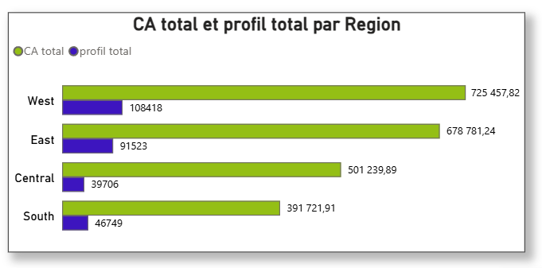
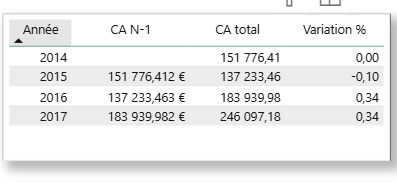
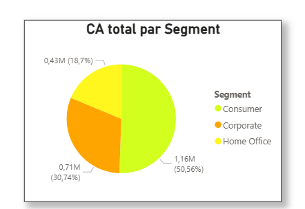
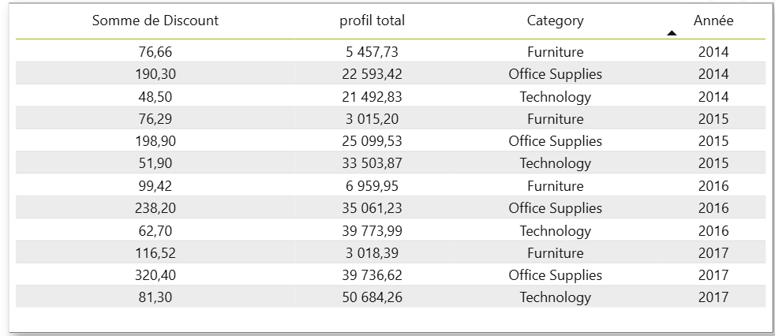
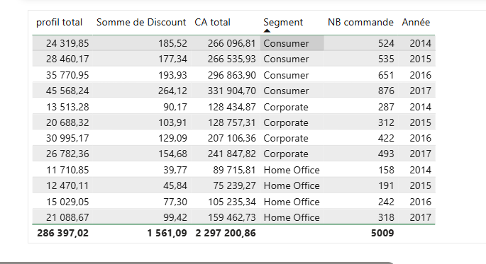

# Superstore Power BI Dashboard

## 📊 Contexte

Ce projet a pour objectif de créer un tableau de bord interactif permettant d’analyser les performances commerciales d’une entreprise de distribution (Global Superstore).

L’objectif est de visualiser rapidement les indicateurs clés et d’identifier les tendances de ventes, les produits performants et les zones géographiques stratégiques.

---

## 🎯 Objectifs

- Analyser le chiffre d’affaires et le profit
- Identifier les produits et catégories les plus performants
- Étudier les performances par région et segment client
- Suivre l’évolution des ventes dans le temps

---

## 🧩 Dashboard

Le dashboard est structuré en 3 pages :

## 📌 KPIs

- CA Total
- Profit Total
- Nombre de commandes
- Taux de marge

---
## 🧠 Modélisation & Mesures DAX
-- Chiffre d’affaires total
CA Total = SUM('Sample - Superstore'[Sales])

-- Profit total
Profit Total = SUM('Sample - Superstore'[Profit])

-- Nombre de commandes (unique)
Nb Commandes = DISTINCTCOUNT('Sample - Superstore'[Order ID])

-- Taux de marge
Taux de marge = DIVIDE([Profit Total], [CA Total], 0)

-- Calendar = CALENDAR(
    MIN('Sample - Superstore'[Order Date]),
    MAX('Sample - Superstore'[Order Date])
)

-- CA de l’année précédente
CA N-1 = CALCULATE([CA Total], SAMEPERIODLASTYEAR(Calendar[Date]))

-- Variation du CA en %
Variation % = DIVIDE([CA Total] - [CA N-1], [CA N-1], 0)

---
### Repondre ou questions 

### chiffre d'affaires total, la marge et le nombre de commandes sur une période donnée 

En 2014, le chiffre d’affaires est de 484,25K € avec un profit de 49,54K € pour 969 commandes.

En 2015, le chiffre d’affaires diminue légèrement à 470,53K €, avec un profit de 61,62K € pour 1038 commandes.

En 2016, le chiffre d’affaires progresse à 609,21K €, accompagné d’un profit de 81,80K € pour 1315 commandes.

En 2017, le chiffre d’affaires atteint son niveau le plus élevé avec 733,22K €, pour un profit de 93,44K € et 1687 commandes.

### 🔝 Produits les plus performants

L’analyse des produits les plus performants montre que le produit **Zebra ZM400 Thermal Label Printer** génère le chiffre d’affaires le plus élevé. Il est suivi par **Zebra GX420t Direct Thermal Printer**, qui constitue également une part importante des ventes.

---

### 📦 Analyse des catégories

À partir du Treemap, on observe que la catégorie **Technology** est la plus performante en termes de chiffre d’affaires, suivie par **Furniture** puis **Office Supplies**.

---
## 🌍 Analyse géographique

 

On observe que la région **West** domine largement en termes de chiffre d’affaires, avec également le niveau de profit le plus élevé. La région **East** affiche également de bonnes performances, bien qu’en retrait par rapport à West.

La région **Central** génère un chiffre d’affaires correct avec un profit positif, ce qui indique une rentabilité globale satisfaisante.

En revanche, la région **South** reste plus faible, avec un volume d’activité limité et un niveau de profit relativement bas.

Globalement, toutes les régions sont rentables, mais on observe un écart de performance important entre les régions les plus fortes (West, East) et les plus faibles (South).

---
## 📈 Évolution des ventes

On observe une baisse du chiffre d’affaires en 2015 par rapport à 2014. Cependant, les ventes repartent à la hausse en 2016 et continuent de progresser en 2017.

Globalement, la tendance est positive sur la période, avec une croissance significative à partir de 2016.

---
## 👥 Analyse des segments clients

On observe que le segment **Consumer** génère la plus grande part du chiffre d’affaires, représentant plus de la moitié des ventes. Le segment **Corporate** arrive en deuxième position avec une contribution significative, tandis que **Home Office** reste le segment le moins performant.

Globalement, l’entreprise dépend fortement du segment **Consumer**, qui constitue le principal moteur de revenus.

---
## 💸 Analyse de l’impact des remises sur la rentabilité

On observe que la catégorie **Office Supplies** présente les niveaux de remises les plus élevés sur l’ensemble des années, tout en générant un profit globalement positif.  

À l’inverse, la catégorie **Furniture**, malgré des niveaux de remises significatifs, affiche des profits plus faibles, voire irréguliers selon les années.  

La catégorie **Technology** maintient un bon niveau de profit avec des remises plus modérées, ce qui indique une meilleure maîtrise de la rentabilité.

Globalement, ces résultats montrent que des remises élevées n’entraînent pas systématiquement des pertes, mais leur impact dépend fortement de la catégorie de produit.

## 👥 Analyse des segments clients

L’analyse des segments montre une forte contribution du segment Consumer, qui constitue le principal moteur de revenus. Les segments Corporate et Home Office restent secondaires mais présentent une dynamique de croissance progressive.

Aucun déséquilibre majeur n’est observé entre les segments, ce qui traduit une structure commerciale globalement saine. Néanmoins, cette configuration met en évidence une dépendance au segment Consumer, ainsi qu’un potentiel de développement sur les segments Corporate et Home Office.

---
## 💡 Insights

---

## 🚀 À venir

- Amélioration du design
- Ajout de nouveaux insights
- Optimisation des visualisations
