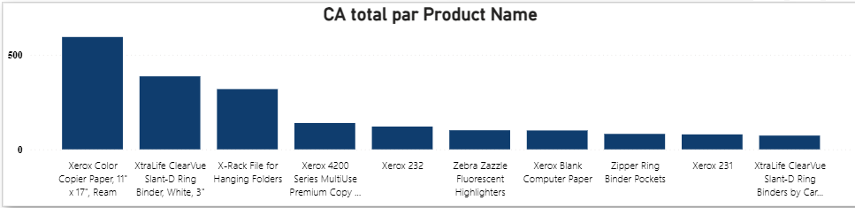
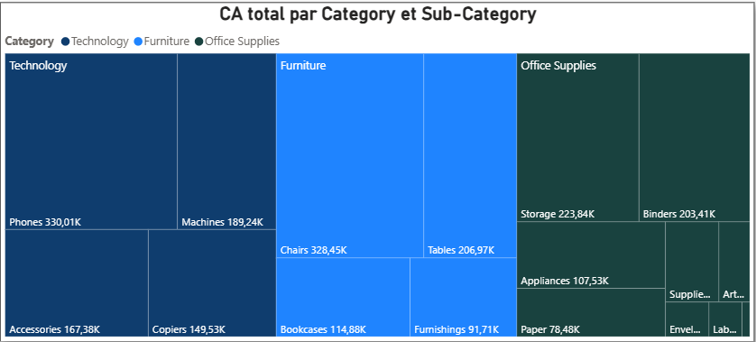

# Superstore Power BI Dashboard

## 📊 Contexte

Ce projet a pour objectif de créer un tableau de bord interactif permettant d’analyser les performances commerciales d’une entreprise de distribution (Global Superstore).

L’objectif est de visualiser rapidement les indicateurs clés et d’identifier les tendances de ventes, les produits performants et les zones géographiques stratégiques.

---

## 🎯 Objectifs

- Analyser le chiffre d’affaires et le profit
- Identifier les produits et catégories les plus performants
- Étudier les performances par région et segment client
- Suivre l’évolution des ventes dans le temps

---

## 🧩 Dashboard

Le dashboard est structuré en 3 pages :

## 📌 KPIs

- CA Total
- Profit Total
- Nombre de commandes
- Taux de marge

---
## 🧠 Modélisation & Mesures DAX
-- Chiffre d’affaires total
CA Total = SUM('Sample - Superstore'[Sales])

-- Profit total
Profit Total = SUM('Sample - Superstore'[Profit])

-- Nombre de commandes (unique)
Nb Commandes = DISTINCTCOUNT('Sample - Superstore'[Order ID])

-- Taux de marge
Taux de marge = DIVIDE([Profit Total], [CA Total], 0)

-- Calendar = CALENDAR(
    MIN('Sample - Superstore'[Order Date]),
    MAX('Sample - Superstore'[Order Date])
)

-- CA de l’année précédente
CA N-1 = CALCULATE([CA Total], SAMEPERIODLASTYEAR(Calendar[Date]))

-- Variation du CA en %
Variation % = DIVIDE([CA Total] - [CA N-1], [CA N-1], 0)

---
### Repondre ou questions 

En 2014, le chiffre d’affaires est de 484,25K € avec un profit de 49,54K € pour 969 commandes.

En 2015, le chiffre d’affaires diminue légèrement à 470,53K €, avec un profit de 61,62K € pour 1038 commandes.

En 2016, le chiffre d’affaires progresse à 609,21K €, accompagné d’un profit de 81,80K € pour 1315 commandes.

En 2017, le chiffre d’affaires atteint son niveau le plus élevé avec 733,22K €, pour un profit de 93,44K € et 1687 commandes.

### 🔝 Produits les plus performants

L’analyse des produits les plus performants montre que le produit **Zebra ZM400 Thermal Label Printer** génère le chiffre d’affaires le plus élevé. Il est suivi par **Zebra GX420t Direct Thermal Printer**, qui constitue également une part importante des ventes.

---

### 📦 Analyse des catégories

À partir du Treemap, on observe que la catégorie **Technology** est la plus performante en termes de chiffre d’affaires, suivie par **Furniture** puis **Office Supplies**.

---

### Page 1 — Vue globale
- KPI : CA total, Profit total, Nb commandes, Taux de marge
- Évolution mensuelle du chiffre d’affaires
- Top 10 produits par CA
- Filtres : Année, Région, Segment, Catégorie

### Page 2 — Produits & Catégories

- Graphique combiné : CA vs Profit
- Scatter plot : Remise vs Profit
- Table détaillée des produits

### Page 3 — Géographie & Segments
- Analyse par région / pays
- Top 10 zones géographiques
- Répartition du CA par segment client
  

---

## 💡 Insights

- Les fortes remises impactent négativement le profit
- Le segment Consumer génère la majorité du chiffre d’affaires
- Certaines régions sont plus performantes que d’autres

---

## 🚀 À venir

- Amélioration du design
- Ajout de nouveaux insights
- Optimisation des visualisations
